<header>

  # Msc Project
_A backup, record and virsion control of my msc project_]

record is just for a record, need to be changed more academic.

  A brief introduction(modification needed):
  	Using video recorded looking down a microscope, it is possible to use blood cells as “tracer particles” to work out what the blood flow is (using particle image velocimetry, or PIV). However, it is known that some analysis methods contain subtle biases caused by out of focus cells, and these biases are hard to quantify - let alone correct for. This project will implement and evaluate one proposed strategy for correcting for bias. The methodology is based on the classic concept of an "inverse problem", as commonly found in physics: it is comparatively easy to predict what measurements will be made if you know the true underlying flow, and this can be leveraged to help solve the inverse problem (what is the true flow, given the measurements). The project will involve scientific image processing, and learning about and applying the mathematics of image formation and deconvolution. The project could potentially have a small experimental component, characterizing experimental images of tracer particles down a microscope, but this is not essential.
</header>

<!--
This is comments block in GitHub markdown

-->

## Secion1. review 
> review on background, methodology, coding tool for realization.
[basic of the piv algorithms](https://openpiv.readthedocs.io/en/latest/src/piv_basics.html)

### 1.1 PIV: what is it about

From Wikipedia: “Particle image velocimetry (PIV) is an optical method of flow visualization used in education and research. It is used to obtain instantaneous velocity measurements and related properties in fluids. The fluid is seeded with tracer particles which, for **sufficiently small particles, are assumed to faithfully follow the flow dynamics (the degree to which the particles faithfully follow the flow is represented by the *[Stokes number](https://en.wikipedia.org/wiki/Stokes_number)*).** The fluid with entrained particles is illuminated so that particles are visible. The motion of the seeding particles is used to calculate speed and direction (the velocity field) of the flow being studied.” Read more at http://en.wikipedia.org/wiki/Particle_image_velocimetry.

### 1.2 PTV vs PIV

PIV(Particle Image Velocity) and PTV(Particle Tracking Velocity) are two types of related flow measurement techniques.

PTV is based on single particle tracking, that the motion(velocity) is obtained by compare and find each particle moving

PIV is based on statistically most, by estimate the motion of groups for velocity calculation.

included in vytautas' thesis section 1.3.4 flow measurement techniques. 
The piv and ptv, also termed as Eulerian and Lagrangian approach, are discribed in sevral cases in [Saidi's paper](https://doi.org/10.1016/j.atmosenv.2014.01.069) to illustrate the difference and criteria for selection.
Also, Fig3 in Scharnowski's paper, ['Particle image velocimetry - Classical operating rules from today’s perspective'](https://doi.org/10.1016/j.optlaseng.2020.106185) denote the difference in result for PIV and PTV in a specific confdition.


### 1.3 Out of focus effect in PIV (Project specification)

[Out-of-focus effects on particle image visibility and correlation in microscopic particle image velocimetry
](https://doi.org/10.1007/s003480070018)

#### 1.3.1 **Depth of correlation**

Different from the light sheet PIV, In microscopic particle image velocimetry (μPIV) the **entire volume of a flow is illuminated**, resulting in all of the particles in the field of view contributing to the image, either by forming discrete particle images or contributing to a background glow. The theory of PIV is expanded to encompass this situation. Equations are derived for a particle image intensity function that yields image diameter and intensity as a function of distance from the object plane, as well as an equation for a new quantity, termed particle visibility. The effect of changing experimental parameters is discussed. Next, the contribution of out-of-focus particles to the correlation function is addressed. A weighting function that can be used to calculate either velocity measurement bias or the distance from the object plane beyond which particles no longer significantly contribute to the correlation function is derived. A new experimental parameter, the depth of correlation, is then introduced.

 Several assumptions are made to deriving a model.
 + all the seed particles have the same diameter, (with a rms variation of less than 5% for example)
 + Then, further assumed the entire field of view is illuminated with equal laser intensity
 + emit light isotropically  
If this is assumed, the fluorescent particles are all illuminated equally and are of identical diameters.

#### 1.3.2 **correlation weighting function**

The correlation weighting function(given by microscope) gives a function to show how out-of-plane particles affect as the distance changes, and can show the depth of correlation intuitively.
and it can be used to calculate the convolution for applying it. Ideal microscopy has a bandpass filter as correlation weighting function.
depth of field may same as it or can be explained.<br/>

Although, the correlation weighting function is given by the microscope, have relationship with the NA(numerical aperture). In the model generation, correlation weighting is related to size and brightness of particles, which is also related to RL Rayleigh length (decided by wavelength, or frequency), they are in different way but result similar.

#### 1.3.3 out of focus effects

For miu-PIV, due to the volume illumination used in BF. DOC effects lead to the superposition of out-of-focus particles contribution, which made correlation peak broadening towards higher velocities in this particular flow scenario, as explained in Figure 3.9 in thesis.
also, the relationship between doc, dof, and how it will affect the CC(cross-correlation matrix/maps), then the calculation of velocity is included in Fig. 2.15 in the thesis.

Vytautas' solve this out of focus effect by using light-sheet method, or termed as SPIM( Selective Plane Illumination Microscopy). However, this project aimed to use including but not limited to deconvolution technology to solve the problem given by out-of-focus effects. Reconstruct all the planes particles distributed from one $\mu$-PIV image.

#### 1.3.4 Others
**confocal microscopy**

[A Confocal Endoscope for Cellular Imaging](https://doi.org/10.15302/J-ENG-2015081) can describe how the confocal microscope work.

**SNR (Signal to Noise Ratio): why it is important in PIV

The red arrows in openPIV analyse result are the velocity calculated to have a low SNR, lower than threshold value.


xxxx

## Section2. Methodology 

### 2.1 Fundamental of PIV
> code in OpenPIV as a tool

#### 2.1.1 Keep the plot in notebook <br/>

`%matplotlib inline`is a magic function with % ahead, can used to keep the plot <br/><br/>


#### 2.1.2 Read the image in .bmp(bitmap digital images) <br/>

```
frame_a  = tools.imread( path / "exp1_001_a.bmp" ) 
frame_b  = tools.imread( path / "exp1_001_b.bmp" )
```

#imread, result in 2Darray and seems dtype is uint8 as default<br/>

```
frame_a = frame_a.astype(np.int32) 
frame_b = frame_b.astype(np.int32) 
```
#frame_a.dtype dtype('int32') .astype to convert datatype<br/><br/>

#### 2.1.3 Color map and color bar <br/>
  >color maps are used to visually represent the data<br/>

color maps can be found in some built-in lib such as [matplotlib.colormaps](https://matplotlib.org/stable/tutorials/colors/colormaps.html). Or we can also [create custom color maps](https://matplotlib.org/stable/gallery/color/custom_cmap.html#sphx-glr-gallery-color-custom-cmap-py). <br/>

**The best colormap for any given data set depends on many things including:**

- Whether representing form or metric data ([Ware](http://ccom.unh.edu/sites/default/files/publications/Ware_1988_CGA_Color_sequences_univariate_maps.pdf))

- Your knowledge of the data set (e.g., is there a critical value from which the other values deviate?)

- If there is an intuitive color scheme for the parameter you are plotting

- If there is a standard in the field the audience may be expecting

---
Combined with the colormaps, a color bar is essential to make it nice
```{
from mpl_toolkits.axes_grid1.axes_divider import make_axes_locatable
fig,ax = plt.subplots(1,2,figsize=(12,10))
im1 = ax[0].imshow(frame_a,cmap=plt.cm.gray)
im2 = ax[1].imshow(frame_b,cmap=plt.cm.gray)
divider = make_axes_locatable(ax[1])
#divider1 = make_axes_locatable(ax[0])
cax = divider.append_axes("right", size="5%", pad=0.05)
#cax1 = divider1.append_axes("left", size="5%", pad=0.05)

plt.colorbar(im2, ax=ax, cax =cax)
#plt.colorbar(im1, ax=ax, cax =cax1)
#plt.cm.get_cmap('gray')
#any 'type' of color map can be got

#fig.dtype

```

There are several questions I have met when adding the color bar:
+ fig cannot be the argument of plt.colorbar with subplot, a specific figure(chosen im2 here for position consideration) should be used
+ The result generated by plt.colorbar is large in size, a divider was used to generate a new axis, cax for colorbar
+ Remember a make_axes_locatable lib needed
+ cax = divider.append_axes establish an empty colorbar, while plt.colorbar filling color in colorbar

#### 2.1.4 Basic arguments design

```
winsize = 32 # pixels, interrogation window size in frame A
searchsize = 38  # pixels, search in image B
overlap = 12 # pixels, 50% overlap
dt = 0.02 # sec, time interval between pulses
```

+ the size of interrogation window should be smaller than search window for a better result
+ the interrogation window should include at minimum, any desired region of particles 
+ search window size should be greater than any valid moving vectors

The Adrian & Westerweel propose four “design rules” for PIV measurement arguments design. These rules were the result of extensive Monte Carlo simulations, exploring various combinations of NI, FI, and FO. The suggested rules are the following:
+ Number of particles per IW NI > 10
+ In-plane motion FI > 0.75
+ Out-of-plane motion FO > 0.75
+ Displacement variation in an IW a < dp

### 2.2 Generate my own model for analyse 

#### 2.2.1 First model
Generate models by myself first to understand particle movement, the out-of-focus effect, and the tool of PIV better.

| image1                              | image2                              |
| ----------------------------------- | ----------------------------------- |
| 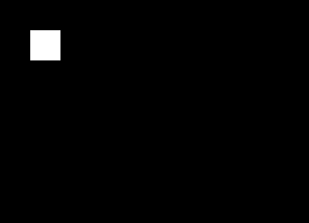 | 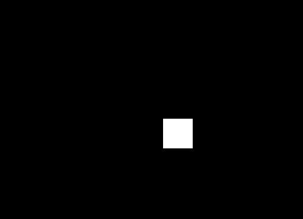 |


The first model is generated  immaturely, a group of particles are generated togrther as a large one, it is an ideal one with a enormous large particle and high speed that large enough interrogation window and search window should be use to find the result.

#### 2.2.2 Second model

| image1                              | image2                              |
| ----------------------------------- | ----------------------------------- |
| 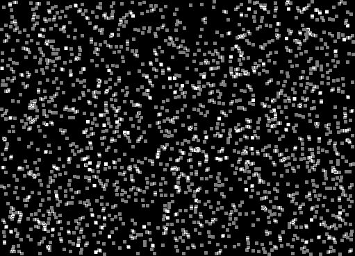 | 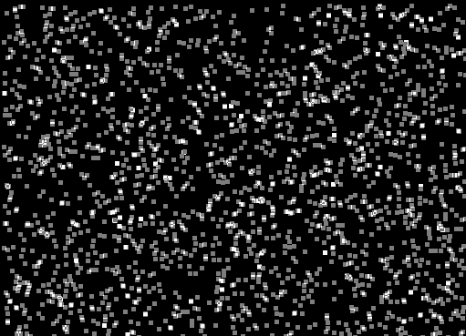 |

The models are generated more realistic that the particles distributed randomly on the canvas to make the model special and easier to analyse the velocity distribution on the whole plane, but the real condition will not consist by only one velocity for all the particles.


#### 2.2.3 Third model

| image1                              | image2                              |
| ----------------------------------- | ----------------------------------- |
| 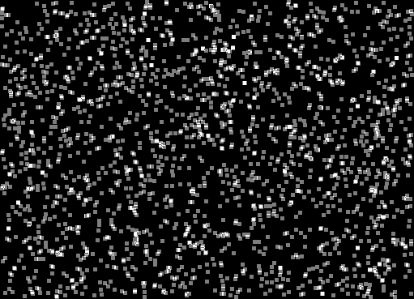 | 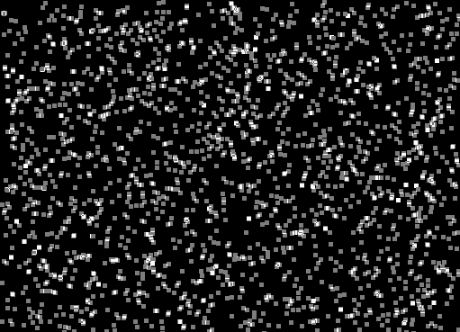 |

For this edition, the code was edited for a better expansibility, that the size, number of groups and velocity can be defined easily. Here, two groups of particles with different velocity are generated. However, the particles are need to be defined more realistic, not shape in square and with uniform intensity overall. The model should be generated more general, instead to this, a circular shape with intensity in gaussian distribution.


#### 2.2.4 Fourth model

| image1                              | image2                              |
| ----------------------------------- | ----------------------------------- |
| 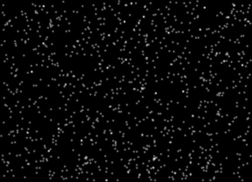 | 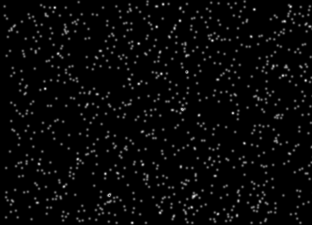 |

The gaussian distributed intensity is applied to the particles. Also, the velocity of particles depends on y axis added to analyse the spatial distribution of velocity.

#### 2.2.4 Final model

| image1                              | image2                              |
| ----------------------------------- | ----------------------------------- |
| 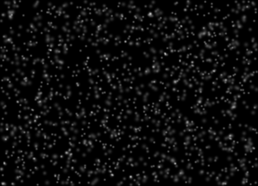 | 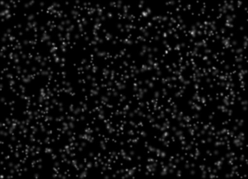 |

The depth(z-axis) is added that particles in different depth have corresponding radius follow gaussian beam width distribution. The particles moves over range will be added back from another side.


### 2.3 PIV to anlyse the data

#### 2.3.1 correlation maps 

[cross correlation](http://paulbourke.net/miscellaneous/correlate/)
disscussion on cross-correlation in zickus's dissertation 2.1.3

### 2.4 deconvolution

#### 2.4.1 2d deconvolution example

[2d image deconvolution example](https://scikit-image.org/docs/stable/auto_examples/filters/plot_deconvolution.html)<br/>
Here we use Richardson-Lucy deconvolution algorithm to perform our deconvolution as it can also deal with n dimension arrays.
The astronaut image sample is used here to show how it works. First, convolve with a kernel(PSF), to obtain a blured image. Then, deconvolve that with the same PSF, the result was shown to be same as original one. Which means, the transform(convolution) with known PSF, can inversly recovered by deconvolution.

#### 2.4.2  deconvole to deblur

Here we know how exactly the particle blured as depth changed, and this blur can be considered as convolution to original image. In this way, the blured images(in stack) can be inversely deblured by deconvolution by a proper chosen PSF.

#### 2.5 deconvolution with correalation matrix

However, the method of doing deconvolution to the 3d image is limited by several factors. First, the 3d image cannot be obtained in one time, the moved particles in different layer would significantly affect the result. Second, in real fluid tissues, particles may not in same size, that the PSF may not possible to be chosen properly.

Thus, compare to deal with 3d image itself, it would be better to deal with the correlation matrix. The correlation matrix represent velocity from the image. Dealing with the correlation matrix directly can prevent being affected by other factors.

## Section3. Results 

### 3.1 multi-velocity effect
| velocity in group1                     | velocity in group2                             |
| ----------------------------------- | ----------------------------------- |
| 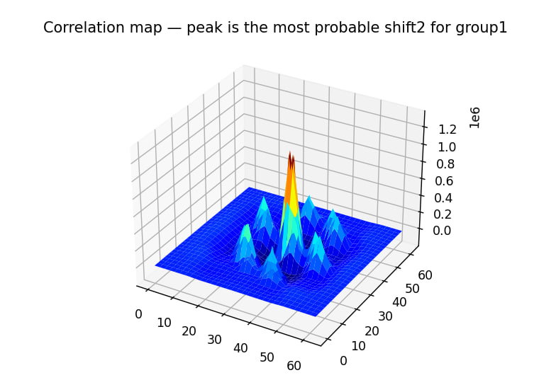 | 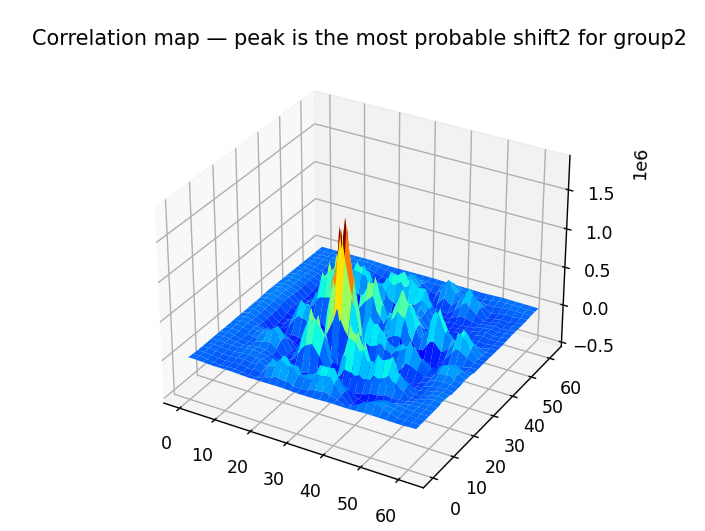 |

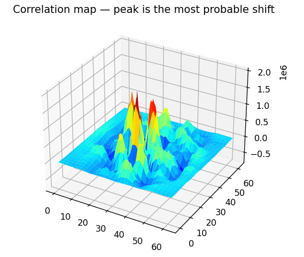

It can be seen from the figure above, the correlation matrix of combined particles is sum of each correlation matrix, some noise are also included. Because of this, the particles in different velocities seperation can increase PIV velocity analysis accuracy.


### 3.2 PIV velocity

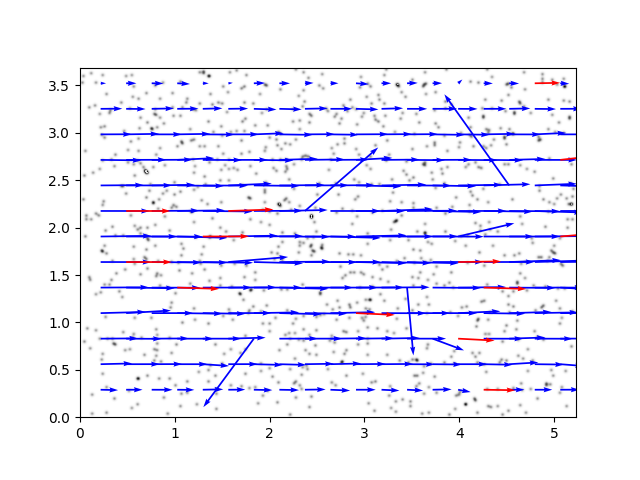


### 3.3 deconvolution

| origin velocity profile          | deconvolved result           |
| ----------------------------------- | ----------------------------------- |
| 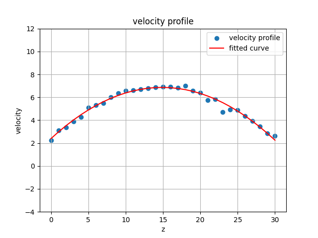 | 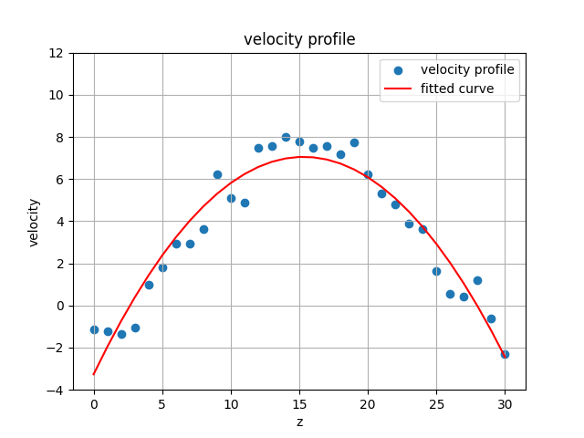 |

from the figure above, it can be easily find the result of velocity profile of deconvolved image have a better velocity curve to  fitted agree with the expected velocity generation function than the origin one, and more smooth than origin with less noise.

### 3.4 correlation matrix deconvolution


## Section4. Discussion

> factors affect the correlation map (how the result quality perform)
disscussion on cross-correlation in zickus's dissertation 2.1.3

### Brainstorm

+ Use the functions in MATLAB as a feature extraction tool to improve(reduce time competitivity (not sure)).
+ The relationship between particle size (if can be different) and velocity can be determined (should be in higher dimensional Gaussian distribution). With the model established, the feature selected might be useful for training the model. Or particle(fluidic) moving mode with different container shape (pipe,square tube?) also can be used to analyse Wall Shear Stress (WSS) potentially.
+ Model migration. Particles moving in the fluid may also be considered for coherence. Light is particle as well. Find the similarity between light coherence and
correlation weighting function.
